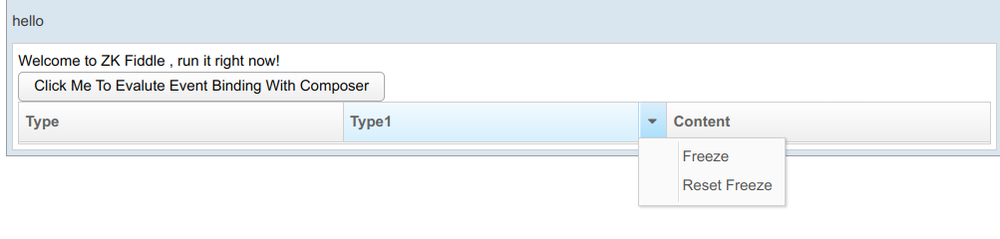
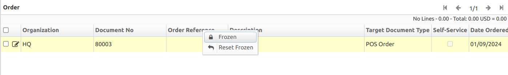

# ISSUE Customized Menupopup On Grid Header

I can use a [Customized menu popup](https://www.zkoss.org/wiki/ZK_Component_Reference/Data/Grid/Columns#Customized_Menupopup) to perform actions related to a particular grid column

It functioned well during the [test](https://zkfiddle.org/sample/gig0j7/5-Customized-Menupopup-On-Grid-Header)

I'm having an issue with iDempiere. The popup window isn't appearing, and the highlight feature isn't turning off. However, the [automatic menu](https://www.zkoss.org/wiki/ZK_Component_Reference/Data/Grid/Columns#Auto) seems to be functioning normally

There's a difference in the editors used: Idempiere has a Community Edition editor, whereas the demo has an Enterprise Edition editor. So it use difference javascrip source code.

It's difficult to pinpoint whether this issue originates from ZK or Idempiere. I'll wait until issue [ZKFIDDLE-10](https://tracker.zkoss.org/browse/ZKFIDDLE-10) is resolved before continuing my investigation.

Finally I need to create and manage the pop-up menu behavior manually

